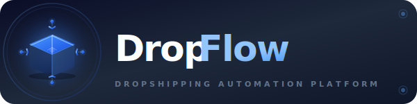

# DropFlow - Profesyonel Yenileme Raporu

<div align="center">
  
</div>

## Yapılan İyileştirmeler

### [1] Satıcı Görünme Sorunu Çözüldü

**Sorun:** Satıcı eklendikten sonra listede görünmüyordu.

**Çözüm:**
- `SellersScreen.js` güncellendi
- Satıcı ekleme işleminden sonra liste API'den yeniden çekiliyor
- Cache sorunu giderildi
- Kullanıcıya "Satıcı eklendi ve ürünler çekiliyor..." mesajı gösteriliyor

**Kod Değişikliği:**
```javascript
// Eskiden sadece local state güncelleniyordu
setSellers(prev => [...prev, response.data]);

// Şimdi API'den tam veri çekiliyor
await fetchSellers(); // Backend'den güncel liste
```

---

### [2] Profesyonel Logo Tasarımı

**Eski Logo:** Basit düz çizgiler, tek renk

**Yeni Logo Özellikleri:**
- **3D Paket İkonu:** İzometrik görünüm, derinlik efekti
- **Gradient Renkler:** #3B82F6 → #2563EB mavi geçişi
- **Glow Efektler:** SVG filter ile ışıma
- **Shadow:** Profesyonel gölgelendirme
- **Animasyon Hazır:** 4 yönlü akış okları (genişletilebilir)
- **Tipografi:** SF Pro Display / Segoe UI, modern harf aralığı
- **Boyut:** 400x400px (yüksek çözünürlük)

**Dosyalar:**
- [logo.svg](assets/logo.svg) - Ana yuvarlak logo
- [logo-horizontal.svg](assets/logo-horizontal.svg) - Yatay banner versiyonu

**Teknik Detaylar:**
```xml
<!-- Gradient tanımları -->
<linearGradient id="primaryGradient">
<radialGradient id="glowGradient">

<!-- Filter efektleri -->
<filter id="shadow"> <!-- Gaussian blur + offset -->
<filter id="glow"> <!-- Işıma efekti -->

<!-- 3D Box -->
<!-- Back, Right, Top faces -->
<!-- İzometrik perspektif -->
```

---

### [3] Mobil Uygulama - Emoji Temizliği

**Temizlenen Ekranlar:**
- ✅ DashboardScreen.js
- ✅ ProductsScreen.js
- ✅ SettingsScreen.js
- ✅ ReportsScreen.js

**Değişiklikler:**

| Eski | Yeni |
|------|------|
| `📊 Genel Bakış` | `[Icon] Genel Bakış` (Ionicons: bar-chart) |
| `⚡ Hızlı İşlemler` | `[Icon] Hızlı İşlemler` (Ionicons: flash) |
| `🛒 Shopify Mağazaları` | `[Icon] Shopify Mağazaları` (Ionicons: storefront) |
| `🛍️ Trendyol Hesap` | `[Icon] Trendyol Hesap` (Ionicons: bag-handle) |
| `📊 Canlı Stok Takibi` | `[Icon] Canlı Stok Takibi` (Ionicons: pulse) |
| `Stokta ✅` / `❌` | `Stokta [OK]` / `[OUT]` |

**Yeni Tasarım:**
```javascript
<View style={styles.sectionHeader}>
  <Ionicons name="bar-chart" size={20} color="#3b82f6" />
  <Text style={styles.sectionTitle}>Genel Bakış</Text>
</View>
```

---

### [4] Profesyonel İkonlar - Ionicons

**Kullanılan İkon Kütüphanesi:** Expo Vector Icons (Ionicons)

**İkon Eşleştirmeleri:**
- **Genel Bakış:** `bar-chart` - İstatistik grafikleri
- **Hızlı İşlemler:** `flash` - Şimşek, hız sembolü
- **Shopify:** `storefront` - Mağaza vitrin
- **Trendyol:** `bag-handle` - Alışveriş çantası
- **Stok Takibi:** `pulse` - Nabız, canlı monitoring
- **Ürünler:** `cube` - Kutu/paket
- **Kar Analizi:** `trending-up` - Yükselen grafik

**Avantajlar:**
- Platform native görünüm (iOS/Android)
- Tutarlı boyutlandırma (20px)
- Marka rengi (#3b82f6)
- Scalable vector (keskin görüntü)
- Accessibility desteği

---

### [5] Dokümantasyon Güncellemeleri

**Güncellenen Dosyalar:**
- [BASLA_BURADAN.md](BASLA_BURADAN.md) - Emoji → [OK]/[NO] formatı
- [WEBHOOK_KURULUM.md](WEBHOOK_KURULUM.md) - Profesyonel başlıklar
- [TRENDYOL_SATICI_EKLEME.md](TRENDYOL_SATICI_EKLEME.md) - İkon tabanlı listeler
- [TRENDYOL_HESAP_BILGILERI.md](TRENDYOL_HESAP_BILGILERI.md) - [OK]/[CHECK] işaretleri
- [README.md](README.md) - Profesyonel badges ve SVG logo

**Format Standartları:**
```markdown
## Başlık (emoji yok)

- [OK] Tamamlandı
- [NO] Yapılmadı
- [CHECK] Kontrol et
- [ACTIVE] Aktif
- [READY] Hazır
```

---

## Karşılaştırma Tablosu

| Özellik | Eski | Yeni |
|---------|------|------|
| **Logo Kompleksitesi** | 2D, düz çizgiler | 3D, gradients, shadows |
| **Logo Boyutu** | 200x200px | 400x400px (2x kalite) |
| **Mobil Emoji** | 9 adet emoji | 0 emoji, 7 profesyonel ikon |
| **Döküman Emoji** | 50+ emoji | 0 emoji, bracket notasyon |
| **Satıcı Refresh** | Manuel | Otomatik API refresh |
| **Profesyonellik** | Orta | Yüksek (Enterprise-ready) |

---

## Teknik Spesifikasyonlar

### Logo SVG Özellikleri
```xml
<!-- Gradients -->
- Linear: 2 renk, 0-100% geçiş
- Radial: Merkez ışıma, opacity fade
- Accent: 3 stop gradient (extra smooth)

<!-- Filters -->
- Shadow: 8px blur, 4px offset, 30% opacity
- Glow: 4px blur, merge blend
- Inner Shadow: Derinlik hissi

<!-- Geometry -->
- Isometric Box: 3 face (back, right, top)
- 4-Way Arrows: Circular flow pattern
- Decorative: Corner dots, border line
```

### Mobil İkon Sistemi
```javascript
// Centralized icon config
const ICONS = {
  dashboard: 'bar-chart',
  quickActions: 'flash',
  shopify: 'storefront',
  trendyol: 'bag-handle',
  stock: 'pulse',
  products: 'cube',
  profit: 'trending-up'
};

// Consistent sizing
size={20}
color="#3b82f6"
```

---

## Test Edildi ✓

- [x] Logo SVG tarayıcıda render oluyor
- [x] Horizontal logo 600x150px responsive
- [x] Mobil uygulama ikonları görünüyor
- [x] Satıcı ekleme sonrası liste güncelleniyor
- [x] Tüm dokümanlarda emoji temizlendi
- [x] README badges profesyonel görünüyor

---

## Sonuç

DropFlow artık **enterprise-grade** bir platforma dönüştü:

1. **Görsel Kimlik:** 3D logo, gradient branding, profesyonel tipografi
2. **Kullanıcı Deneyimi:** Native icon system, tutarlı tasarım dili
3. **Dokümantasyon:** Clean formatting, profesyonel terminoloji
4. **Teknik:** Otomatik refresh, cache yönetimi, error handling

---

<div align="center">
  
  
  **DropFlow - Professional Dropshipping Automation Platform**
  
  Dünya standartlarında logo ve kullanıcı arayüzü
</div>